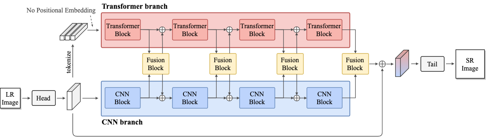
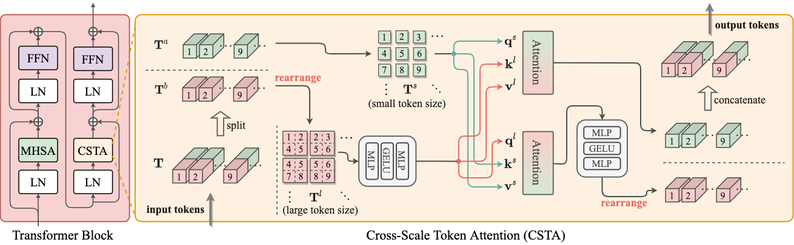
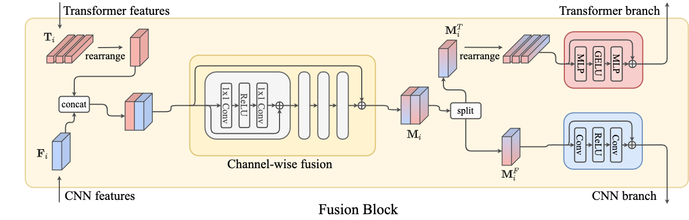

# ACT for SR

This repository provide the code and model of our work:

**Enriched CNN-Transformer Feature Aggregation Networks for Super-Resolution** \
Jinsu Yoo<sup>1</sup>, Taehoon Kim<sup>2</sup>, Sihaeng Lee<sup>2</sup>, Seung Hwan Kim<sup>2</sup>, Honglak Lee<sup>2</sup>, Tae Hyun Kim<sup>1</sup> \
<sup>1</sup>Hanyang University, <sup>2</sup>LG AI Research \
WACV 2023

[](https://arxiv.org/abs/2203.07682)

> Recent transformer-based super-resolution (SR) methods have achieved promising results against conventional CNN-based methods.
However, these approaches suffer from essential shortsightedness created by only utilizing the standard self-attention-based reasoning.
In this paper, we introduce an effective hybrid SR network to aggregate enriched features, including local features from CNNs and long-range multi-scale dependencies captured by transformers.
Specifically, our network comprises transformer and convolutional branches, which synergetically complement each representation during the restoration procedure.
Furthermore, we propose a cross-scale token attention module, allowing the transformer branch to exploit the informative relationships among tokens across different scales efficiently.
Our proposed method achieves state-of-the-art SR results on numerous benchmark datasets.

## Table of Contents

- [Concept](#concept)
- [How to run](#how-to-run)
  - [Installation](#installation)
  - [Quick test with pre-trained weights](#quick-test-with-pre-trained-weights)
  - [Train model](#training-model)
  - [Test model](#test-model)
- [Citation](#citation)
- [Acknowledgement](#acknowledgement)


## Concept

### Effective two branch architecture



### Efficient cross-scale attention



### Fusion block to mix representations



## How to run

### Installation

```bash
# Clone this repo
git clone https://github.com/jinsuyoo/act.git
cd act

# Create and activate conda environment
conda env create -f environments.yaml
conda activate act
```

### Prepare dataset

For training, please download [imagenet dataset](https://www.image-net.org/). The dataset should be like:

```
act
|--- datasets
      |--- imagenet
            |--- train
                  |--- n0xxxxxxx_x.JPEG
                  |--- n0xxxxxxx_0x.JPEG
                  |--- n0xxxxxxx_00x.JPEG
                  |--- ...
            |--- val
                  |--- ILSVR2012_val_000xxxxx.JPEG
                  |--- ILSVR2012_val_000xxxxx.JPEG
                  |--- ILSVR2012_val_000xxxxx.JPEG
                  |--- ...
```

For test with conventional datasets, some benchmark SR datasets can be downloaded from [this repo](https://github.com/sanghyun-son/EDSR-PyTorch).

Please place the datasets under './datasets' directory.

### Ouick test with pre-trained weights

Following commands will automatically download the pretrained weights. The test results will be saved under './experiments/test/[save_path]'.

```bash
python test.py --release
               --task sr 
               --scale [2|3|4]
               --data_test [Set5|Set14|B100|Urban100|Manga109]
               --save_path [PATH TO SAVE THE RESULTS]

# Example) test x2 SR on Set5 dataset with pretrained weight
python test.py --release --task sr --scale 2 --data_test Set5 --save_path act_x2_set5

# Example) test x3 SR on Set14 dataset with pretrained weight
python test.py --release --task sr --scale 3 --data_test Set14 --save_path act_x3_set14

# Example) test x4 SR on B100 dataset with pretrained weight
python test.py --release --task sr --scale 4 --data_test B100 --save_path act_x4_b100
```

### Train model

```bash
python train.py --gpus [NUM GPUS]
                --task [sr] 
                --scale [2|3|4]
                --batch_size [BATCH_SIZE_PER_GPU]
                --data_train [ImageNet]
                --data_test [Set14]
                --save_path [PATH TO SAVE THE RESULTS]

# Example) ddp training of x2 SR with 8 gpus
CUDA_VISIBLE_DEVICES=0,1,2,3,4,5,6,7 python train.py --gpus 8 --task sr --scale 2 --batch_size 64 --data_test Set14 --save act_sr_x2 
```

### Test model

```bash
python test.py --task sr 
               --scale [2|3|4]
               --data_test [Set5|Set14|B100|Urban100|Manga109]
               --ckpt_path [PATH TO YOUR CHECKPOINT]
               --save_path [PATH TO SAVE THE RESULTS]
```

## Citation

If you find our work useful in your research, please consider citing our paper:

```bibtex
@inproceedings{yoo2023act,
  title={Enriched CNN-Transformer Feature Aggregation Networks for Super-Resolution},
  author={Yoo, Jinsu and Kim, Taehoon and Lee, Sihaeng and Kim, Seung Hwan and Lee, Honglak and Kim, Tae Hyun},
  booktitle={Proceedings of the IEEE/CVF Winter Conference on Applications of Computer Vision (WACV)},
  year={2023}
}
```

## Acknowledgement

The codes are based on: 
- [EDSR-PyTorch](https://github.com/sanghyun-son/EDSR-PyTorch)
- [RCAN](https://github.com/yulunzhang/RCAN)
- [Pretrained-IPT](https://github.com/huawei-noah/Pretrained-IPT) 
- [ResizeRight](https://github.com/assafshocher/ResizeRight)
- [vit-pytorch](https://github.com/lucidrains/vit-pytorch)
- [SwinIR](https://github.com/JingyunLiang/SwinIR)

Thanks for open sourcing such a wonderful works!
